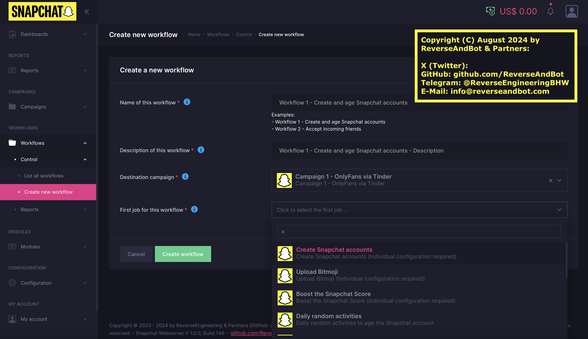

# Snapchat-Bot

&nbsp;

## Snapchat API Bot - SaaS solution - Based on the hidden Snapchat iOS API - Working as of January 2025
&nbsp;

Screenshot: How to create a Snapchat bot workflow, consisting of several jobs (tasks)

&nbsp;

> [!NOTE]
> Last update of this page: January 4th, 2025

&nbsp;

&nbsp;

> [!TIP]
> All Snapchat API bot modules have been working without problems ***since January 2024***.
> 
> Release of the SaaS solution (see below) to the ***next group of selected qualified customers***: approx. around January 20th, 2025
> 
> ***New: Selected Snapchat bot modules are already available, also the Snapchat account creation service. Please talk to us.*** 
> 
> Reasons for the current delays: Pending dedicated server hardware delivery (CPU, NVMe, RAM, special components), issues at 2 of the housing providers.

> [!IMPORTANT]
> Please follow us and also "star" and watch this repository to
> - receive updates
> - get notified about new modules and features
> - not miss the release with limited customer slots (given to a new ***group of selected qualified customers***)
> - receive discounts for trial accounts
> 
> If you don't have a GitHub account, you simply can sign up here with your email address only. The account is free of charge.

&nbsp;

### Snapchat API Bot (SaaS solution)

- Based on the hidden Snapchat iOS API.

- Working as of January 2025 (watch a video of the working Snapchat API bot below).

- Please remember: Most people use poor Snapchat bots based on Android, a very low number uses Snapchat bots based on iOS. Stay safe and use iOS!

- Compatible with Snapchat 12.x and 13.x for ***iOS*** (version 12.96.0 up to version 13.21.0 for iOS)

- Tokens for Snapchat 12.x and 13.x for ***Android*** optionally available on request

- Complete SaaS [^1] solution:

  - Everything runs in the background on our servers 24/7.
  - Advanced "web panel" solution (2 frontend servers, 10+ backend servers).
  - Setup the workflows once with your favorite browser.
  - No installation required.
  - No poor Android solution (bots for iOS are safer than bots for Android).
  - No poor ADB bridge (no connected devices).
  - No poor signer being used. C++ example code here: https://github.com/ReverseAndBot/Snapchat-Bot/blob/main/SnapchatGenerateTokens.cpp
  - No poor browser module.
  - No Appium or XCUITest solution.
  - No phones required, no tablets required, no emulators required, no browser emulation required, no own server required.

- A few examples of available modules (as of January 2025):

  - Snapchat ***Account Creator*** (available immediately)
  - Snapchat Account Ager (warm up)
  - Snapchat Bitmoji Uploader (configuration based on presets and custom settings)
  - Snapchat Score Booster
  - Automated Snapchat account verification (by email, SMS optionally)
  - Automated Snapchat verification code handling (by email, SMS optionally)
  - Snapchat ***Friend Adder***
  - Snapchat "Quick add" ***Friend Adder***
  - Snapchat ***Friend Accept***
  - Snapchat ***Friend Scraper*** (internally at Snapchat, no external websites) at predefined countries/regions/cities
  - Automated detection of genders (female, male) of the Snapchat users based on our own custom internal AI
  - Automated detection of locations (countries, regions, cities) of the Snapchat users based on our own custom internal AI
  - Automated activity detections based on our own custom internal API
  - Snapchat Snap Sender incl. scheduler (once, daily, weekly, monthly etc.)
  - Snapchat Story Poster incl. scheduler (once, daily, weekly, monthly etc.)
  - Snapchat ***Chat/Messenger*** incl. auto responder (scheduled messages based on events/keywords)
  - Chat/Messenger supports ChatGPT and/or our own custom internal AI and/or Spintax
  - Snapchat Link Cloaker (hide your links from malware detection tools, scrapers, bots, prevent a sudden Snapchat ban etc.)
  - Additional professional options for OnlyFans agencies (OFM)
  - CupidBot replacement (a single setup is enough, everything will run on our servers 24/7 using the Snapchat API, without any interaction by you)
  - Full integration into the Tinder API Bot solution (100 % automation): https://github.com/ReverseAndBot/Tinder-Bot
  - Fake live timestamps ("Upload 1 second ago")
  - No "Upload from memories" marker
  - No "Upload from camera roll" marker
  - API service available for professional users
  - Snapchat Signer service available for selected professional users
  - ***New: Snapchat account creation service available for selected professional users immediately***
  - ***Interesting new modules and workflows will follow in January 2025 (please talk to us after January 7th, 2025, please "star" this repository)***
  - etc.
 
- List to be continued soon.

- Standard modules included in all of our SaaS API bots, like e. g. https://github.com/ReverseAndBot/Tinder-Bot

  - Proxy support (mobile, residential, data center, static, rotating, own setup etc.)
  - Definition of proxy <-> account relations (e. g. fixed proxy IP address for each account)
  - Proxy grouping
  - Proxy monitoring with automated error corrections and proactive notifications
  - Emulation of "human" activities
  - Emulation of delays (fully customizable) and breaks
  - Bulk uploads of images/videos
  - Bulk uploads of userlists (friends to be added)
  - Bulk uploads of Snapchat accounts
  - Bulk uploads of proxy definitions
  - Bulk uploads of email addresses (to be used by the Snapchat Account Creator)
  - Advanced management interface for Snapchat accounts, friend lists, proxy servers, email addresses etc.
  - Modern user interface components based on current UX (User Experience) research studies with real users
  - "5 Minute Quick Start" incl. useful example data

&nbsp;

> [!IMPORTANT]
> Please follow us and also "star" and watch this repository to
> - receive updates
> - get notified about new modules and features
> - not miss the release with limited customer slots (given to a new ***group of selected qualified customers***)
> - receive discounts for trial accounts
> 
> If you don't have a GitHub account, you simply can sign up here with your email address only. The account is free of charge.

&nbsp;

### More information

<!--
- More information: https://x.com/ReverseAndBot
-->

- Contact:

  - X (Twitter): <!-- ReverseAndBot - https://x.com/ReverseAndBot -->
  - Telegram: @ReverseEngineeringBHW - https://telegram.me/ReverseEngineeringBHW (problems with the Telegram account during November/December 2024, it may be replaced and announced here)
  - GitLab: ReverseAndBot - https://gitlab.com/ReverseAndBot/Snapchat-Bot
  - RapidAPI: ReverseAndBot - https://rapidapi.com/user/ReverseAndBot
  - GitHub: ReverseAndBot - https://github.com/ReverseAndBot/Snapchat-Bot

  [^1]: "SaaS" = Software as a Service = https://en.wikipedia.org/wiki/Software_as_a_service

&nbsp;

### Screenshots and videos

- How to create a Snapchat bot workflow (video):

https://github.com/user-attachments/assets/57d7e2b7-9012-4855-aa21-d6e364a73604

- Typical Snapchat bot configuration (campaigns, workflows, jobs, ...):

&nbsp;

&nbsp;

### Keywords

Snapchat Bot - Snapchat API Bot - Snapchat API - Snapchat API Endpoints - Reverse Engineering - Reverse Engineer - Reverse-Engineering - Reverse-Engineer - SSL Pinning - SSL Unpinning - SSL-Pinning - SSL-Unpinning - X-Snapchat-Att - X-Snapchat-Att-Token - X-Snap-Access-Token - X-Snapchat-Client-Auth-Token - CupidBot - Tinder - Bumble - Badoo - OnlyFans - OFM
